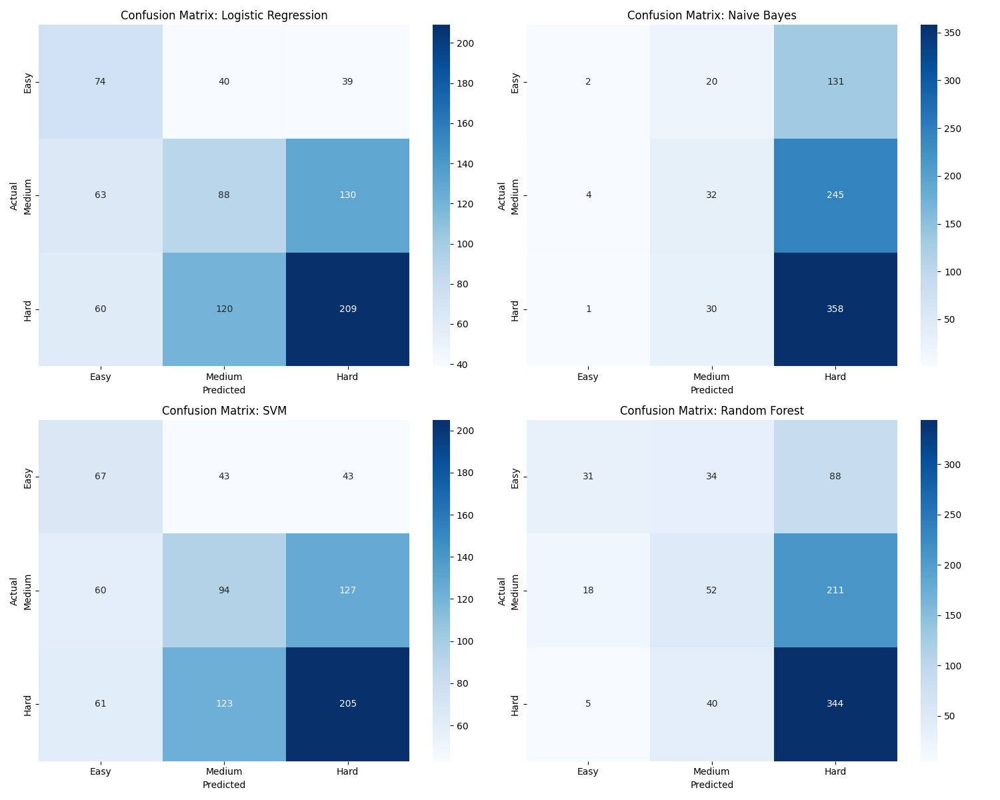

# AUTOJUDGE: Programming Problem Difficulty Predictor
## Overview

Competitive programming platforms (Kattis, Codeforces, etc.) classify problems by difficulty.

This project automates that process using Machine Learning while using only **textual description**.

By analyzing the textual description of a problem, the system predicts:

**Difficulty Class**: Categorizes problems into Easy, Medium, or Hard

**Difficulty Score**: Assigns a precise numerical score (1 – 10)

## DataSet Used
The dataset was given dataset by ACM which contained:
1. Title
2. Description
3. input_description
4. output_description
5. sample_io
6. problem_class
7. problem_score
8. url


## Data Preprocessing 
1. The title,sample_io,url did not seem to contribute to guess the difficulty level so they were removed.
2. No null entries, but handled the empty strings by replacing.
3. Kept the numbers and math symbols for sure as they tell how tough a problem could be.
4. Converted the special characters like ö to normal characters.
5. Lowercased everything.
6. Removed stop words while preseving few.

## Feature Engineering

Simple word counts were insufficient.
The final model uses a Hybrid Feature Set to capture both technical language and mathematical constraints.

### 1️. NLP Features

1. TF-IDF Vectorization: Analyzes unigrams and bigrams
2. Logic-Aware Cleaning: Custom preprocessing preserves:
      1. Programming keywords (if, while, for)
      2. LaTeX-style mathematical symbols (\leq, \geq)
         (These are often removed by standard cleaners)

### 2. Handcrafted Features
1. Power: Detects constraints like 10^5 or 10^9 to estimate time complexity
2. Algorithm Density: Frequency of keywords like **dp, graph, union-find, recursion**
3. Math Symbol Count: Density of operators (+ - * /) and comparison symbols (< > =)
4. Constraint Complexity: Pattern detection such as N ≤ 10^5

## Model Selection 
### 1. Classification (Easy / Medium / Hard)

We compared four models to determine which best handled the nuances of "Medium" difficulty problems.


| Model               | Accuracy | F1-Score (Medium) | Observation                                           |
| ------------------- | -------- | ----------------- | ----------------------------------------------------- |
| Random Forest       | 54%      | 0.65              | Best overall accuracy; very strong on Medium problems |
| Naive Bayes         | 48%      | 0.65              | High recall for Medium, but ignores Hard problems     |
| Logistic Regression | 46%      | 0.56              | Most balanced; best at catching Hard problems         |
| SVM (Linear)        | 45%      | 0.56              | High precision but computationally slower             |

<p float="left">
  
  
</p>

Confusion Matrices
<p float="left">
  
</p>


### 2️. Regression (Numerical Score)

Evaluated using:
MAE (Mean Absolute Error) → lower is better
R² Score → higher is better

| Model                   | MAE (↓ Better) | R² (↑ Better) |
| ----------------------- | -------------- | ------------- |
| Random Forest Regressor | 1.63           | 0.42          |
| Gradient Boosting       | 1.71           | 0.40          |
| Linear Regression       | 1.97           | 0.28          |


## Repo Structure 
```bash
AutoJudge/
|── .devcontainer/
|      └── devcontainer.json                      
├── data/
│   ├── problems_data.jsonl          # Raw dataset (input for training)
│   └── cleaned_problems_data.jsonl  # Preprocessed data used for final modeling
├── models/
│   ├── classifier.joblib            # Trained Random Forest Classification model
│   ├── regressor.joblib             # Trained Random Forest Regression model
│   ├── tfidf_vectorizer.joblib      # Saved TF-IDF fitted on the training vocabulary
│   └── confusion_matrix.png         # Visual evaluation metric for the report
├── src/
│   ├── preprocessing.py             # Core logic for text cleaning & handcrafted features
│   └── train.py                     # Execution script to train models and save assets
|── .gitignore                       # Makes sure unnnecessary files are not pushed by git
├── app.py                           # Streamlit Web UI code for local/cloud deployment
├── requirements.txt                 # List of Python libraries (scikit-learn, streamlit, etc.)
├── README.md                        # Project overview, setup guide, and demo link
└── report.pdf                       # Formal 4–8 page technical project report
```

##  How to Run (VS Code Setup)

### 0. Clone this repo into VS Code and change into this Repo
```bash
git clone https://github.com/the-sisyphean/AutoJudge.git
cd AutoJudge
```

### 1️. Environment Setup

Ensure Python 3.8+ is installed. In your terminal:

```bash
# 1. Create a virtual environment
python -m venv .venv

# 2. Activate it 
# On Windows:
.venv\Scripts\activate
# On Mac/Linux:
source .venv/bin/activate

# 3. Install dependencies
pip install -r requirements.txt

# 4. Download NLP data
python -m nltk.downloader stopwords wordnet omw-1.4
```

### 2️. Training the Model

Process the raw data and generate the saved model files:

```bash
python src/train.py
```

This creates the /models folder containing your .joblib files.

### 3️. Launching the App

Start the Streamlit web interface:

```bash
streamlit run app.py
```


